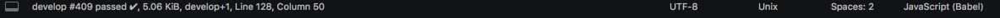

# Travis CI Statusbar integration for Sublime Text

> Shows current build status of active branch from Travis CI in the status bar for Sublime Text 3.



### Getting Started

Set the following keys in your **User Preferences**.

- `travis_api_token` is **required**. You can get this from [https://developer.travis-ci.com/authentication](https://developer.travis-ci.com/authentication)
- `travis_private_projects` is optional. If set to true, the plugin will use https://api.travis-ci.com instead of https://api.travis-ci.org as its endpoint.

```
{
  "travis_api_token": "",
  "travis_private_projects": false,
}
```

#### Setup

By default, this plugin reads information from your git configuration for the current directory. You can  add the following to your local git config `/.git/config`:

```
[travis]
    slug = <repo>/<repo-name>
```

This slug must match the location of where it resides on travis-ci.com/org (`travis-ci.org/<repo>/<repo-name>`).

#### Projects

You can avoid having to set git configs by creating a project and setting the following `settings key` inside of your project config:

```
"settings": {
    "travis_project_repo": "<repo>/<repo-name>"
}
```

This will override any slug set by git config.

### Errors

By default, if there is an error or a setting is configured incorrectly the status bar will be normal and not show any build information. If you believe everything is configured correctly, you can view the console to see internal API errors.

### Acknowledgements

- [@Section214](https://github.com/Section214/ST3-Travis-CI) for original code.
- [@pichillilorenzo](https://github.com/pichillilorenzo/JavaScript-Completions) for status bar animation
